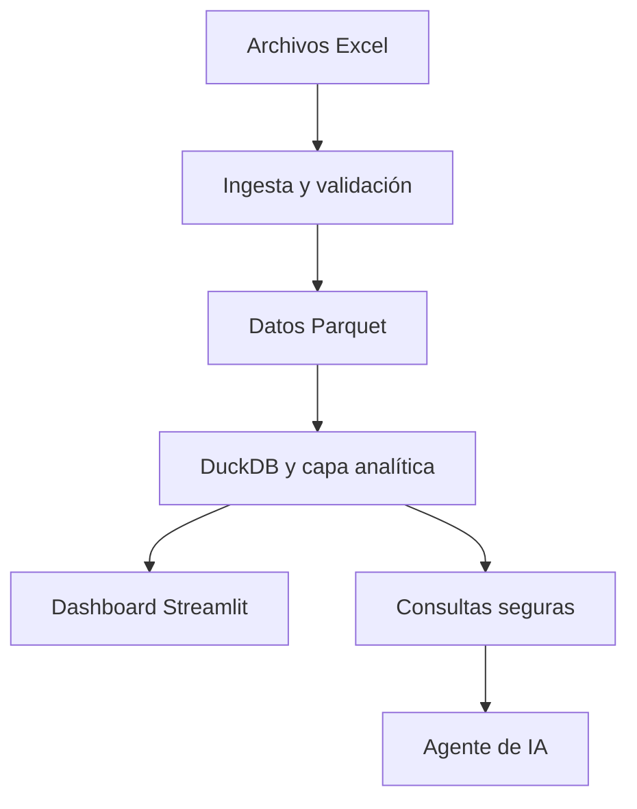

# Plan de acción multiagente — EduGuate IA

## 1. Objetivo

Construir una aplicación web que transforme los 4,298,887 registros codificados del dataset **Educación Formal 2024** en información comprensible mediante:

1. Un proceso reproducible de ingesta, limpieza y decodificación.
2. Un dashboard interactivo con gráficas y explicaciones escritas.
3. Un agente que responda preguntas en lenguaje natural usando cifras calculadas sobre los datos reales.

La prioridad es entregar una solución correcta, modular, reproducible y fácil de explicar durante el pitch. El proyecto no debe crecer fuera del alcance descrito en este documento sin autorización del coordinador.

## 2. Alcance del MVP

### Incluido

- Procesamiento de los 22 archivos departamentales.
- Conversión de Excel a Parquet.
- Decodificación de las 15 columnas originales.
- Normalización del prefijo `00-` del departamento de Guatemala.
- Derivación correcta del municipio desde `CodEstablecimiento`.
- Indicadores nacionales, departamentales y municipales.
- Filtros por departamento, municipio, nivel, sector, área, sexo, pueblo, jornada y resultado.
- Vista general y vista territorial.
- Al menos cuatro visualizaciones acompañadas de análisis escrito.
- Agente con consultas controladas y respuestas basadas en resultados calculados.
- Pruebas automáticas, README, documentación de arquitectura y decisiones.

### Fuera del alcance inicial

- Autenticación y administración de usuarios.
- Aplicación móvil.
- Edición de registros.
- Predicciones o comparaciones históricas.
- Seguimiento individual de estudiantes.
- Información de edad, notas, discapacidad, docentes o infraestructura.
- SQL libre generado y ejecutado directamente por el modelo de IA.
- Base de datos remota obligatoria.

## 3. Stack aprobado

| Componente | Tecnología |
|---|---|
| Lenguaje | Python 3.11 o 3.12 |
| Ingesta | Polars y openpyxl |
| Datos procesados | Parquet |
| Motor analítico | DuckDB |
| Aplicación | Streamlit |
| Visualizaciones | Plotly |
| IA | OpenAI API con salida JSON estructurada |
| Validación | Pydantic |
| Pruebas | Pytest |
| Calidad | Ruff |
| Versionamiento | Git y GitHub |

No agregar frameworks o servicios adicionales sin justificar la necesidad en `docs/decisions.md`.

## 4. Arquitectura acordada



Principio central: **la IA interpreta y explica; el código calcula las cifras**. El modelo no recibe millones de filas ni ejecuta SQL arbitrario.

## 5. Contratos que todos los agentes deben respetar

### 5.1 Grano del dataset

Una fila representa una inscripción durante el ciclo escolar 2024. No representa necesariamente una persona única y no permite seguimiento longitudinal.

### 5.2 Esquema procesado mínimo

| Campo | Tipo esperado | Descripción |
|---|---|---|
| `anio` | Int16 | Año escolar |
| `codigo_establecimiento` | String | Código original normalizado |
| `departamento_codigo` | Int8 | Código 1–22 |
| `departamento` | String | Etiqueta legible |
| `municipio_codigo` | String | Código de cuatro dígitos |
| `municipio` | String | Etiqueta legible |
| `sector` | String | Público, Privado, Municipal o Cooperativa |
| `area` | String | Urbana, Rural o Ignorado |
| `sexo` | String | Hombre, Mujer o Ignorado |
| `grado` | Int8 | Debe interpretarse con `nivel` |
| `nivel` | String | Nivel educativo |
| `pueblo_pertenencia` | String | Pueblo de pertenencia |
| `plan_estudios` | String | Modalidad de asistencia |
| `jornada` | String | Jornada educativa |
| `resultado` | String | Promovido, Vigente, Retirado, Retirado definitivo, No promovido o Ignorado |
| `repitente` | String | Sí, No o Ignorado |
| `graduando` | String | Sí, No o Ignorado |

### 5.3 Tratamiento estadístico

- Los códigos `9` se conservan como `Ignorado`; no deben convertirse silenciosamente en valores nulos.
- Para la métrica consolidada de retiro se combinan `Retirado` y `Retirado definitivo`.
- Las tasas de resultado usan como denominador los registros con resultado `Promovido`, `No promovido`, `Retirado` o `Retirado definitivo`.
- `Vigente` e `Ignorado` se muestran por separado y se excluyen de esas tasas.
- Toda cifra debe conservar el contexto y los filtros aplicados.
- No se debe llamar “número de escuelas” al conteo único de `codigo_establecimiento`, porque un establecimiento puede tener varios códigos por nivel.

### 5.4 Formato de consultas del agente

El agente debe producir un objeto validable similar a:

```json
{
  "metric": "withdrawal_rate",
  "filters": {
    "department": "Quetzaltenango",
    "level": "Básico"
  },
  "group_by": "municipality",
  "limit": 10
}
```

Valores permitidos para `metric` en el MVP:

- `enrollment_count`
- `promotion_rate`
- `non_promotion_rate`
- `withdrawal_rate`
- `repetition_rate`
- `distribution`
- `ranking`
- `comparison`

Los nombres internos pueden estar en inglés y la interfaz debe estar en español.

## 6. Estructura del repositorio

```text
eduguate-ia/
├── app.py
├── data/
│   ├── raw/
│   ├── processed/
│   └── samples/
├── src/
│   ├── ingestion/
│   │   ├── catalogs.py
│   │   ├── loader.py
│   │   ├── cleaner.py
│   │   └── validation.py
│   ├── analytics/
│   │   ├── indicators.py
│   │   ├── queries.py
│   │   └── narratives.py
│   ├── agent/
│   │   ├── schemas.py
│   │   ├── interpreter.py
│   │   ├── guardrails.py
│   │   └── responses.py
│   └── dashboard/
│       ├── filters.py
│       ├── charts.py
│       ├── overview.py
│       ├── territory.py
│       └── chat.py
├── scripts/
│   ├── download_data.py
│   └── process_data.py
├── tests/
│   ├── test_ingestion.py
│   ├── test_indicators.py
│   ├── test_queries.py
│   └── test_agent.py
├── docs/
│   ├── architecture.md
│   ├── decisions.md
│   ├── data_dictionary.md
│   └── ai_usage.md
├── .env.example
├── .gitignore
├── pyproject.toml
├── requirements.txt
└── README.md
```

## 7. Distribución del trabajo

### Agente 0 — Coordinación, arquitectura e integración

**Objetivo:** mantener coherencia técnica e integrar el trabajo de todos.

**Tareas:**

- Crear la estructura base del repositorio.
- Definir `requirements.txt`, `pyproject.toml`, `.gitignore` y `.env.example`.
- Publicar el contrato de datos y un Parquet de muestra pequeño.
- Revisar que los módulos usen interfaces compatibles.
- Integrar ramas en el orden establecido.
- Resolver conflictos sin eliminar trabajo válido.
- Ejecutar toda la suite de pruebas y el arranque limpio.
- Mantener `docs/architecture.md` y `docs/decisions.md`.

**Entregables:** base del repositorio, arquitectura, integración final y versión candidata.

**Criterio de aceptación:** una instalación limpia puede procesar la muestra, iniciar Streamlit y ejecutar las pruebas.

### Agente 1 — Ingesta y calidad de datos

**Objetivo:** producir el dataset procesado correcto y reproducible.

**Tareas:**

- Descargar o localizar los 23 archivos.
- Detectar la hoja válida por encabezados, no por posición.
- Unificar nombres y tipos de columnas.
- Implementar catálogos de códigos.
- Normalizar el prefijo `00-` de Guatemala antes de derivar municipio.
- Derivar el municipio desde `CodEstablecimiento`.
- Mantener `Ignorado` como categoría explícita.
- Exportar Parquet particionado o único, según medición de rendimiento.
- Crear un reporte JSON con conteos y validaciones.
- Agregar pruebas unitarias de casos especiales.

**Archivos bajo su responsabilidad:** `src/ingestion/`, `scripts/download_data.py`, `scripts/process_data.py`, `tests/test_ingestion.py` y `docs/data_dictionary.md`.

**Criterios de aceptación:**

- 4,298,887 registros.
- 17 municipios en Guatemala.
- Aproximadamente 340 municipios nacionales con datos.
- Distribuciones cercanas a las cifras oficiales de control.
- Ejecución repetible sin edición manual de archivos.

### Agente 2 — Analítica, consultas e indicadores

**Objetivo:** crear una única fuente confiable para todos los cálculos.

**Tareas:**

- Configurar consultas DuckDB sobre Parquet.
- Implementar filtros reutilizables y parametrizados.
- Implementar conteos, tasas, distribuciones, rankings y comparaciones.
- Centralizar las fórmulas para que dashboard y agente usen exactamente el mismo código.
- Generar análisis deterministas: mayor valor, menor valor, diferencia y participación.
- Devolver datos tabulares más metadatos de filtros y denominadores.
- Crear pruebas con conjuntos pequeños cuyos resultados puedan calcularse manualmente.

**Archivos bajo su responsabilidad:** `src/analytics/` y `tests/test_indicators.py`, `tests/test_queries.py`.

**Interfaz de salida sugerida:**

```python
{
    "metric": "withdrawal_rate",
    "value": 5.42,
    "unit": "percent",
    "filters": {"department": "Quetzaltenango"},
    "numerator": 1200,
    "denominator": 22140,
    "rows": []
}
```

**Criterio de aceptación:** ningún cálculo está duplicado dentro del dashboard o del agente.

### Agente 3 — Dashboard y experiencia de usuario

**Objetivo:** construir una interfaz clara para personas sin formación estadística.

**Tareas:**

- Crear navegación entre Inicio, Vista general, Exploración territorial, Metodología y Pregunta a los datos.
- Implementar filtros conectados y estados vacíos.
- Mostrar tarjetas con total, promoción, no promoción y retiro.
- Crear al menos cuatro visualizaciones Plotly.
- Añadir explicación escrita junto a cada visualización.
- Mostrar fuente, filtros activos y significado de las tasas.
- Manejar carga, error y ausencia de resultados.
- Evitar tablas excesivamente grandes y gráficas confusas.

**Archivos bajo su responsabilidad:** `app.py` y `src/dashboard/`.

**Criterio de aceptación:** el usuario puede pasar de una vista nacional a una municipal, entender las gráficas sin consultar el diccionario y restablecer filtros.

### Agente 4 — Agente de IA y controles

**Objetivo:** responder preguntas naturales sin inventar cifras.

**Tareas:**

- Definir el esquema Pydantic de intención.
- Convertir la pregunta a métrica, filtros, agrupación y límite.
- Validar columnas, categorías y operaciones permitidas.
- Llamar exclusivamente a la capa analítica del Agente 2.
- Redactar la respuesta con resultados calculados.
- Mostrar fuente y filtros aplicados.
- Solicitar aclaración cuando falte información importante.
- Rechazar preguntas sobre variables ausentes o fuera del alcance.
- Crear un modo de demostración sin API que funcione con preguntas predefinidas o interpretación básica.
- Evitar exponer claves, prompts internos o trazas técnicas.

**Archivos bajo su responsabilidad:** `src/agent/`, `src/dashboard/chat.py` y `tests/test_agent.py`.

**Criterio de aceptación:** responde correctamente el banco de preguntas válido, rechaza las preguntas imposibles y nunca calcula cifras mediante el modelo.

### Agente 5 — QA, reproducibilidad, documentación y entrega

**Objetivo:** comprobar la calidad y preparar la presentación final.

**Tareas:**

- Diseñar la matriz de pruebas funcionales.
- Verificar instalación desde cero siguiendo solamente el README.
- Ejecutar Ruff y Pytest.
- Probar al menos 15 preguntas del agente: 10 válidas, 3 imposibles y 2 ambiguas.
- Verificar las cifras de control del reto.
- Revisar ausencia de secretos y archivos pesados en Git.
- Completar README, arquitectura, decisiones y uso de IA.
- Preparar guiones para dos videos de tres minutos.
- Preparar guion de pitch de cinco minutos y posibles preguntas del jurado.

**Archivos bajo su responsabilidad:** `README.md`, documentación de entrega y reporte de pruebas.

**Criterio de aceptación:** un tercero puede clonar, configurar y ejecutar el proyecto sin ayuda del equipo.

## 8. Dependencias y orden de trabajo

| Etapa | Responsables | Dependencia | Resultado |
|---|---|---|---|
| 1. Base y contratos | Agente 0 | Ninguna | Estructura, esquema y muestra |
| 2. Ingesta | Agente 1 | Contrato | Parquet validado |
| 3. Analítica | Agente 2 | Muestra; después Parquet real | API interna de métricas |
| 4. Dashboard | Agente 3 | Muestra y contrato analítico | Interfaz completa |
| 5. Agente IA | Agente 4 | Contrato analítico | Chat controlado |
| 6. QA y entrega | Agente 5 | Versiones integradas | Evidencia, README y pitch |
| 7. Integración final | Agente 0 | Todos los módulos | Versión candidata |

Los agentes 2, 3 y 4 pueden avanzar en paralelo utilizando datos de muestra. No deben asumir que la muestra contiene todos los valores posibles.

## 9. Protocolo de colaboración

### Ramas

- `main`: versión estable.
- `develop`: integración.
- `feature/ingestion`
- `feature/analytics`
- `feature/dashboard`
- `feature/agent`
- `feature/qa-docs`

### Reglas de edición

- Cada archivo tiene un responsable principal.
- No modificar archivos de otro agente sin coordinarlo.
- No renombrar interfaces compartidas sin actualizar contrato y consumidores.
- Hacer commits pequeños con mensajes claros.
- No incluir `.env`, claves, datos originales ni archivos generados pesados.
- No ejecutar cambios destructivos sobre trabajo ajeno.
- Toda corrección debe incluir o actualizar una prueba cuando sea posible.

### Formato de entrega de cada agente

Cada agente debe informar:

1. Qué implementó.
2. Archivos creados o modificados.
3. Cómo probarlo.
4. Resultados de las pruebas.
5. Decisiones y supuestos.
6. Problemas pendientes.
7. Dependencias que afectan a otros agentes.

## 10. Hitos

### Hito 1 — Esqueleto ejecutable

- Repositorio creado.
- Dependencias instalables.
- Streamlit inicia.
- Datos de muestra disponibles.
- Contratos publicados.

### Hito 2 — Datos confiables

- 22 archivos procesados.
- Parquet generado.
- Controles de volumen y distribución aprobados.
- Casos especiales documentados.

### Hito 3 — Dashboard funcional

- Indicadores centralizados.
- Vista general y territorial.
- Filtros y gráficas funcionales.
- Análisis escrito visible.

### Hito 4 — Agente seguro

- Interpretación estructurada.
- Consultas validadas.
- Respuestas con cifras reales.
- Rechazos y aclaraciones correctos.

### Hito 5 — Versión candidata

- Pruebas aprobadas.
- README reproducible.
- Sin secretos.
- Videos y pitch preparados.
- Demostración de respaldo disponible.

## 11. Definición global de terminado

El proyecto se considera terminado cuando:

- Procesa exactamente 4,298,887 filas.
- Reporta 17 municipios para Guatemala.
- Las cifras principales coinciden razonablemente con las referencias del reto.
- Dashboard y agente consumen la misma capa analítica.
- La IA no inventa ni calcula cifras.
- Existe al menos una vista general y una desagregación territorial.
- Cada gráfica relevante tiene una explicación comprensible.
- Las pruebas automáticas pasan.
- El repositorio arranca siguiendo el README.
- No contiene credenciales ni archivos innecesarios.
- El equipo puede explicar cada componente y decisión.

## 12. Banco mínimo de preguntas para validar el agente

### Debe responder

1. ¿Cuántas inscripciones hay en Quetzaltenango?
2. ¿Qué departamento tiene más inscripciones?
3. ¿Cuál es la tasa de no promoción en nivel básico?
4. ¿Se retiran más estudiantes en área rural o urbana?
5. Compara la tasa de promoción de Guatemala y Quetzaltenango.
6. ¿Cómo se distribuyen las inscripciones por sector?
7. ¿Qué municipios de Quetzaltenango tienen mayor tasa de retiro?
8. ¿Cuántos estudiantes de primaria pertenecen al sector público?
9. ¿Cuál es la distribución por sexo en Alta Verapaz?
10. ¿Por qué el dashboard señala determinado nivel como crítico?

### Debe rechazar o limitar

1. ¿Cuál fue la nota promedio de los estudiantes?
2. ¿Cuántos estudiantes tienen discapacidad?
3. ¿Cómo cambió la educación desde 2020?

### Debe solicitar aclaración

1. ¿Cuál es el mejor departamento?
2. ¿Dónde hay más problemas educativos?

## 13. Riesgos y mitigación

| Riesgo | Mitigación |
|---|---|
| Resultados incorrectos por el prefijo `00-` | Prueba específica y control de 17 municipios |
| Excel consume demasiada memoria | Lectura por archivo y conversión temprana a Parquet |
| Agente inventa cifras | Cálculo determinista y salida estructurada validada |
| Diferencias entre dashboard y chat | Una sola capa de indicadores |
| Dependencia de Internet durante la exposición | Modo local y respuestas de demostración |
| Conflictos entre agentes | Propiedad de archivos, contratos y rama `develop` |
| Se pierde tiempo en funciones secundarias | Congelamiento del MVP tras el Hito 1 |
| README no reproduce el sistema | Prueba en entorno limpio por el Agente 5 |

## 14. Prompts listos para asignar

### Prompt común para todos

> Estás trabajando en EduGuate IA. Lee completamente este plan antes de editar. Respeta el alcance, arquitectura, esquema de datos, reglas estadísticas, propiedad de archivos y definición de terminado. No cambies contratos compartidos sin documentarlo. Implementa solo tu asignación, agrega pruebas y termina con un reporte que indique cambios, forma de ejecución, pruebas, supuestos, pendientes y dependencias.

### Prompt para Agente 1

> Implementa la ingesta y validación descritas en la sección Agente 1. Prioriza exactitud, tratamiento del prefijo `00-`, detección de hoja válida, catálogos y Parquet. Incluye pruebas y un reporte de validación. No construyas dashboard ni agente conversacional.

### Prompt para Agente 2

> Implementa la capa analítica descrita en la sección Agente 2. Todas las métricas deben estar centralizadas, ser consultables con filtros seguros y devolver resultados con metadatos, numerador y denominador cuando corresponda. Trabaja inicialmente con la muestra y verifica después con el Parquet definitivo.

### Prompt para Agente 3

> Implementa el dashboard Streamlit descrito en la sección Agente 3. Consume únicamente la interfaz analítica acordada; no dupliques SQL ni fórmulas. Diseña para personas sin formación estadística y agrega estados de carga, error y ausencia de resultados.

### Prompt para Agente 4

> Implementa el agente de IA descrito en la sección Agente 4. El modelo solo interpreta y redacta; la capa analítica calcula. Usa un esquema estructurado, listas permitidas, validación y respuestas fuera de alcance. Incluye modo de demostración sin API y pruebas del banco mínimo.

### Prompt para Agente 5

> Realiza QA, revisión de reproducibilidad y documentación según la sección Agente 5. No ocultes fallos: regístralos con severidad, pasos de reproducción y evidencia. Verifica instalación limpia, cifras de control, secretos, preguntas del agente y preparación del pitch.

## 15. Checklist final de entrega

- [ ] Repositorio público y ordenado.
- [ ] Licencia incluida.
- [ ] README probado desde cero.
- [ ] Script de descarga o instrucciones de datos.
- [ ] Script de procesamiento reproducible.
- [ ] 4,298,887 registros validados.
- [ ] 17 municipios de Guatemala validados.
- [ ] Dashboard con vista general y territorial.
- [ ] Cuatro o más gráficas con análisis escrito.
- [ ] Agente responde datos y explica análisis.
- [ ] Preguntas imposibles se rechazan correctamente.
- [ ] `.env.example` sin credenciales reales.
- [ ] Pruebas y revisión de estilo aprobadas.
- [ ] Arquitectura y decisiones documentadas.
- [ ] Uso de IA documentado.
- [ ] Video de arquitectura de máximo tres minutos.
- [ ] Video de funcionamiento de máximo tres minutos.
- [ ] Pitch de cinco minutos ensayado.
- [ ] Capturas o video local como respaldo de la demostración.

