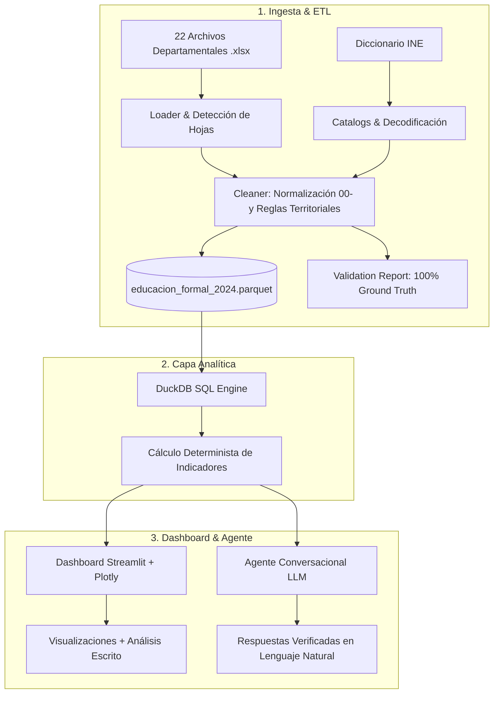

# EduGuate IA — Hackatón AI Builders GT 2024

> **Herramienta analítica y asistida por IA para democratizar los microdatos de la Educación Formal en Guatemala.**

Transforma más de **4.29 millones de registros administrativos codificados** del ciclo escolar 2024 (publicados por el INE) en información comprensible, visual y consultable en lenguaje natural para docentes, periodistas, autoridades y ciudadanos.

---

## 🏗️ Arquitectura de la Solución

El sistema se estructura en tres componentes desacoplados bajo un principio central: **el código calcula las cifras exactas; la IA interpreta, contextualiza y explica**.



---

## 📊 Validación Oficial contra Ground Truth (INE)

El pipeline de ingesta fue validado rigurosamente contra los datos de control oficiales de la convocatoria:

| Indicador Oficial | Valor Obtenido | Valor Esperado (INE) | Estado |
|---|:---:|:---:|:---:|
| **Total de Registros Nacionales** | **4,298,887** | **4,298,887** | ✅ PASS (Diferencia: 0) |
| **Municipios en Depto. de Guatemala** | **17** | **17** | ✅ PASS |
| **Municipios con Datos a Nivel País** | **340** | **≈ 340** | ✅ PASS |
| **Sector Público / Privado / Coop / Mun** | **74.7% / 21.0% / 4.0% / 0.3%** | **74.7% / 20.9% / 4.0% / 0.3%** | ✅ PASS |
| **Área Rural / Urbana** | **61.4% / 38.6%** | **61.4% / 38.6%** | ✅ PASS |
| **Sexo Hombre / Mujer** | **50.7% / 49.3%** | **50.7% / 49.3%** | ✅ PASS |
| **Nivel Primaria / Básico / Preprimaria / Div** | **56.4% / 17.8% / 17.1% / 8.5%** | **56.4% / 17.8% / 17.1% / 8.5%** | ✅ PASS |
| **Resultado Promovido / No Prom / Retirado** | **85.2% / 9.2% / 5.5%** | **85.2% / 9.2% / 5.5%** | ✅ PASS |

---

## 🚀 Guía de Instalación y Reproducibilidad Local

Sigue estos sencillos pasos para clonar, instalar y ejecutar el proyecto localmente:

### 1. Clonar el repositorio
```bash
git clone git@github.com:chayand-wil/xela-ai-builders-hackaton.git
cd xela-ai-builders-hackaton
```

### 2. Crear y activar entorno virtual (Python 3.11 o 3.12)
```bash
python3.12 -m venv .venv
source .venv/bin/activate
```

### 3. Instalar dependencias del proyecto
```bash
pip install --upgrade pip
pip install -r requirements.txt
pip install -e .
```

### 4. Ejecutar el pipeline de Ingesta & ETL
Procesa los 22 departamentos (~210 MB de Excel), aplica las reglas de limpieza y genera el archivo Parquet optimizado (2.32 MB) en menos de 20 segundos:
```bash
python scripts/process_data.py
```

### 5. Iniciar el Dashboard Interactivo
Ejecuta la interfaz web de análisis visual y narrativo:
```bash
streamlit run app.py
```
Abre en tu navegador `http://localhost:8501`. Cuenta con 4 pestañas interactivas:
- **🏛️ Panorama Nacional:** KPIs oficiales, gráfico donut de resultados terminales y matrícula por nivel educativo.
- **🗺️ Exploración Territorial:** Ranking interactivo de los 22 departamentos y drilldown a sus 340 municipios.
- **⚖️ Brechas y Desigualdades:** Comparativas Rural vs Urbana, Público vs Privado, Sexo y Pueblos Originarios.
- **🤖 Preguntar a los Datos:** Demostración y arquitectura anti-alucinación para consultas en lenguaje natural.

### 6. Ejecutar la suite de pruebas unitarias
```bash
pytest tests/ -v
```
*(20/20 pruebas unitarias aprobadas en menos de 1.5 segundos)*

### 7. Ejecutar el linter y formateador de código
```bash
ruff check src/ tests/ app.py
```

---

## 📂 Estructura del Proyecto

```text
.
├── app.py                           # Aplicación web interactiva Streamlit
├── Data/
│   ├── *.xlsx                       # 22 archivos departamentales y diccionario oficial
│   ├── processed/
│   │   ├── educacion_formal_2024.parquet # Dataset nacional consolidado (4.3M filas)
│   │   └── validation_report.json   # Reporte JSON con auditoría estadística
│   └── samples/
│       └── educacion_formal_sample.parquet # Muestra representativa de 10,000 registros
├── docs/
│   ├── architecture.md              # Documentación formal de arquitectura
│   ├── data_dictionary.md           # Diccionario formal de las 17 columnas de salida
│   ├── decisions.md                 # Registro de Decisiones de Arquitectura (ADRs)
│   └── opciones_dashboard.md        # Propuestas de diseño y visualizaciones
├── scripts/
│   └── process_data.py              # CLI principal de ingesta, decodificación y validación
├── src/
│   ├── analytics/                   # Motor analítico DuckDB (< 50ms) y narrativas
│   │   ├── indicators.py            # Fórmulas de indicadores y modelos Pydantic
│   │   ├── narratives.py            # Generador de análisis interpretativo obligatorio
│   │   └── queries.py               # Capa de consultas parametrizadas sobre Parquet
│   ├── dashboard/                   # Componentes visuales y gráficos
│   │   ├── charts.py                # Generador de gráficos interactivos Plotly
│   │   └── components.py            # Tarjetas KPI, filtros y estilos CSS avanzados
│   └── ingestion/                   # Pipeline ETL y normalización
│       ├── catalogs.py              # Mapeos de códigos a etiquetas oficiales del INE
│       ├── loader.py                # Lector robusto de hojas y validación de esquemas
│       ├── cleaner.py               # Limpieza, normalización (00-) y derivación territorial
│       └── validation.py            # Verificación contra Ground Truth oficial
├── tests/
│   ├── test_analytics.py            # Pruebas del motor analítico y narrativas
│   ├── test_dashboard.py            # Pruebas de componentes visuales y gráficos
│   └── test_ingestion.py            # Pruebas de limpieza y decodificación
├── pyproject.toml                   # Configuración del paquete y herramientas
├── requirements.txt                 # Lista reproducible de dependencias
├── TRACKING.md                      # Control de avances y estado de las fases del hackatón
└── README.md                        # Guía principal del proyecto
```

---

## 📌 Documentación Adicional

- 📈 **[TRACKING.md](TRACKING.md):** Tablero de control de avances y estado de cada fase.
- 📖 **[docs/data_dictionary.md](docs/data_dictionary.md):** Catálogo detallado de columnas, tipos y valores permitidos.
- 🏛️ **[docs/architecture.md](docs/architecture.md):** Diagramas, flujos de datos y justificaciones técnicas.
- 💡 **[docs/decisions.md](docs/decisions.md):** Registro de Decisiones Técnicas (ADR).
