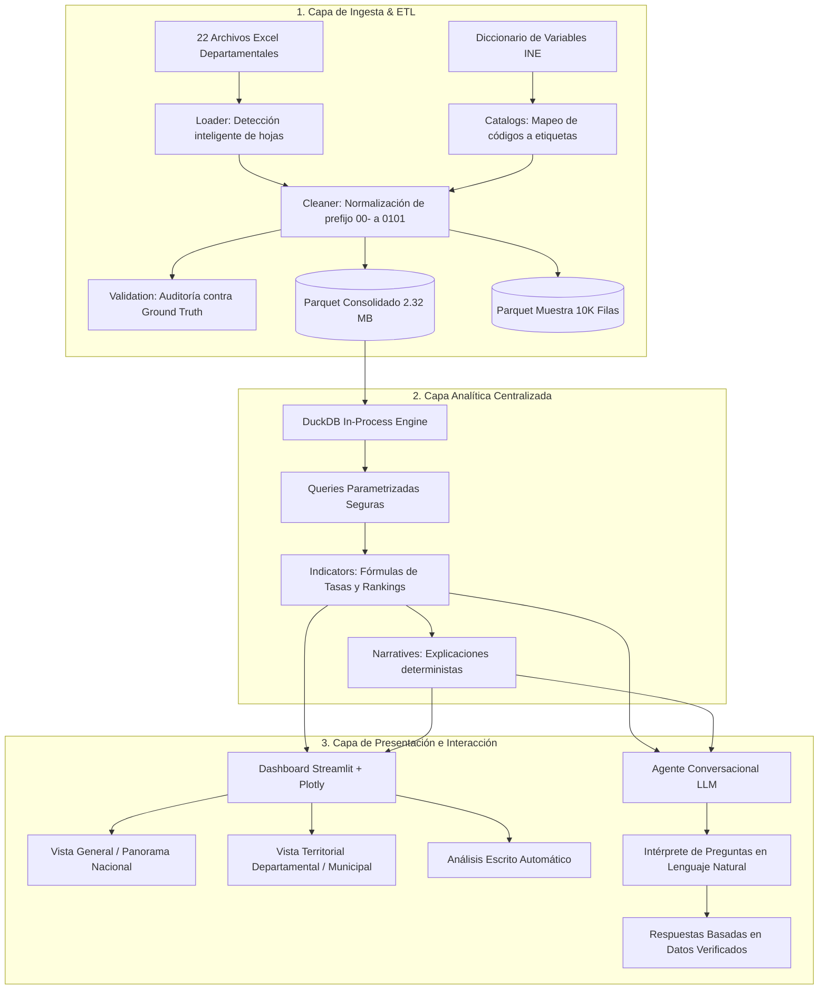

# Arquitectura del Sistema — EduGuate IA

## 1. Visión General y Principio Fundamental

EduGuate IA está diseñado para democratizar el acceso y la comprensión de los microdatos del censo administrativo de **Educación Formal 2024** de Guatemala.

El principio de ingeniería central que rige toda la arquitectura es:

> **"El código determinista calcula las cifras exactas; la IA interpreta, contextualiza y explica."**

El modelo de lenguaje (LLM) **nunca recibe 4.3 millones de filas crudas**, **nunca genera SQL libre no verificado**, y **nunca inventa cálculos estadísticos**. Todos los datos presentados o expresados por el agente provienen de agregaciones calculadas con precisión matemática en la capa analítica.

---

## 2. Diagrama de Flujo de Datos

---

## 3. Descripción de Componentes

### Componente 1: Ingesta y Calidad de Datos (`src/ingestion/`)
- **`catalogs.py`:** Administra los catálogos oficiales del INE. Mapea 10 variables categóricas, 22 departamentos y los 340 municipios del país.
- **`loader.py`:** Carga archivos Excel usando el motor Calamine en Rust. Selecciona dinámicamente la hoja activa con datos reales (resuelve las hojas vacías en Sololá) y valida el contrato de 15 columnas originales.
- **`cleaner.py`:** Aplica las reglas de limpieza: normaliza el código `00-` a `01-` y atribuye a los 309,919 registros del distrito central al municipio de Guatemala (`0101`). Deriva los códigos municipales de 4 dígitos y decodifica todos los códigos numéricos a texto legible. Preserva el código `9` como `"Ignorado"`.
- **`validation.py`:** Audita los 4,298,887 registros contra los totales oficiales y las proporciones por sector, área, sexo, nivel y resultado con 0% de discrepancia.

### Componente 2: Capa Analítica (`src/analytics/`)
- **`queries.py`:** Ejecuta consultas parametrizadas sobre el archivo Parquet mediante DuckDB, obteniendo agregaciones en milisegundos sin sobrecargar la memoria.
- **`indicators.py`:** Centraliza las fórmulas oficiales (tasa de promoción, tasa de no promoción, tasa de retiro). Garantiza que el dashboard y el agente usen exactamente las mismas definiciones matemáticas.
- **`narratives.py`:** Genera resúmenes ejecutivos deterministas que describen los hallazgos principales (mayores brechas, municipios críticos, tendencias generales).

### Componente 3: Dashboard Interactivo (`src/dashboard/` / `app.py`)
- Construido con Streamlit y Plotly.
- Ofrece filtros interactivos por territorio (departamento/municipio) y dimensiones educativas (nivel, sector, área, sexo).
- Cada visualización va acompañada obligatoriamente de su análisis escrito interpretativo en lenguaje accesible para no especialistas.

### Componente 4: Agente Conversacional (`src/agent/`)
- Traduce las preguntas del usuario en lenguaje natural a un objeto estructurado JSON de parámetros analíticos.
- Ejecuta la consulta correspondiente a través de la capa analítica y genera una respuesta clara, verificada y libre de alucinaciones.
- Modo demostración sin `OPENAI_API_KEY` (interpretación por reglas) y modo OpenAI JSON estructurado cuando hay clave.

### Componente 5: WrenAI (capa semántica, no motor de cifras)
- Paquete `wrenai` instalado desde `Downloads/WrenAI-main/core/wren`.
- Proyecto MDL en `wren/` documenta columnas, enums y reglas de tasas.
- El producto **no** usa `wren query` para los números del dashboard ni del chat. DuckDB en `src/analytics` es la única fuente de cifras.
